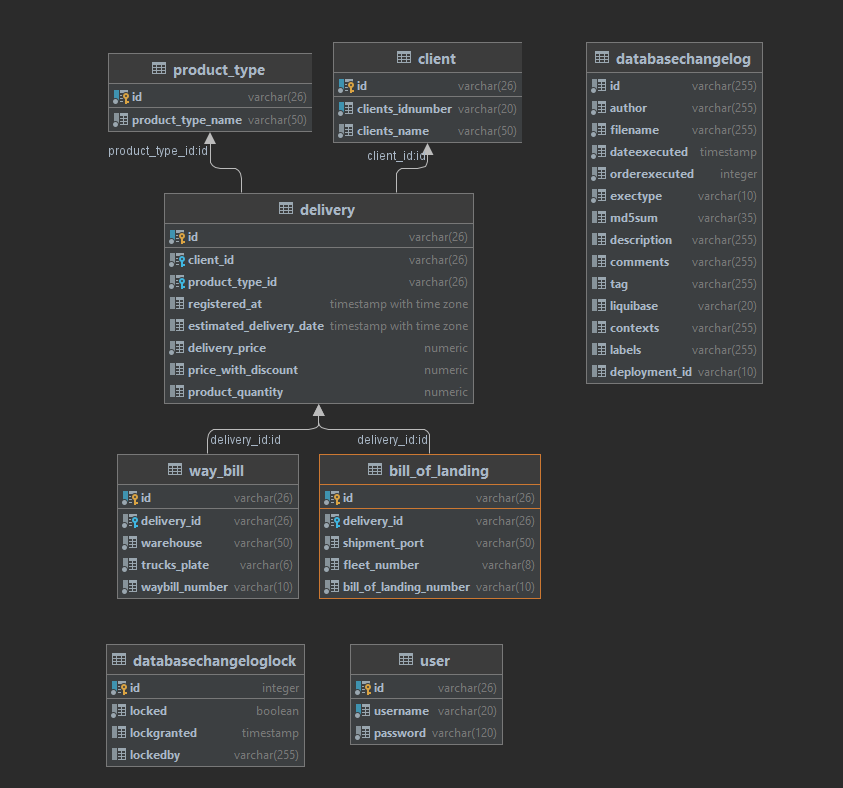
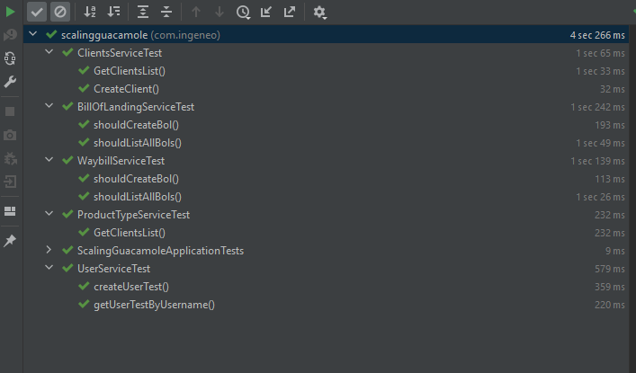
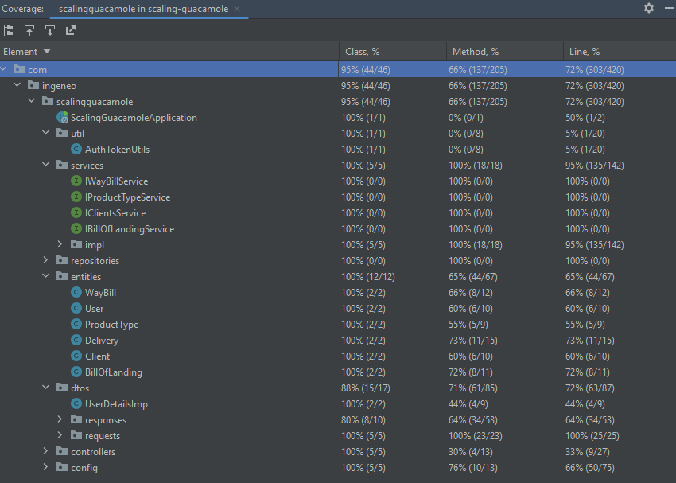

# Sistema logistica

## Swagger documentation
Puede encontrar la documentacion: @ https://ingeneo-bak.herokuapp.com/ingeneo-test-api/swagger-ui/#/

## Backend Endpoints:

*REPO:* https://github.com/lennin92/scaling-guacamole

*URL:* https://ingeneo-bak.herokuapp.com/ingeneo-test-api/

## Frontend App:

*REPO:* https://github.com/lennin92/psychic-carnival

*URL:* https://ingeneo-front.herokuapp.com/login

### Usuarios:

* **user:** USER1 / **pass:** passw0rd1
* **user:** USER2 / **pass:** passw_rd2
* **user:** USER3 / **pass:** p4ssw0rd_3

## Database Schema:

## Unit tests

### Suit de unit test: 

### Covertura:

* Class : 95%
* Method : 66%
* Line: 72%

## Scripts BD:
Para el mantenimiento efectivo de la base de datos, se usó flyway para la gestion automatizada de migraciones.
Los scripts están ubicados en [src/main/resources/db/changelog/migrations](src/main/resources/db/changelog/migrations)

## Stack tecnológico

* Spring boot: Para el desarrollo ágil de la solución; mucho del trabajo fue configurar todo correctamente.
* Heroku: Facilita el despliegue de aplicaciones en la nube.
* PostgreSQL: Integracion automatizada con heroku.
* Angular: Desarrollo rapido de frontend (cabe aclarar que no suelo programar frontend, mi fuerte siempre será backend)
* Liquibase: Gestion automatizada de migraciones